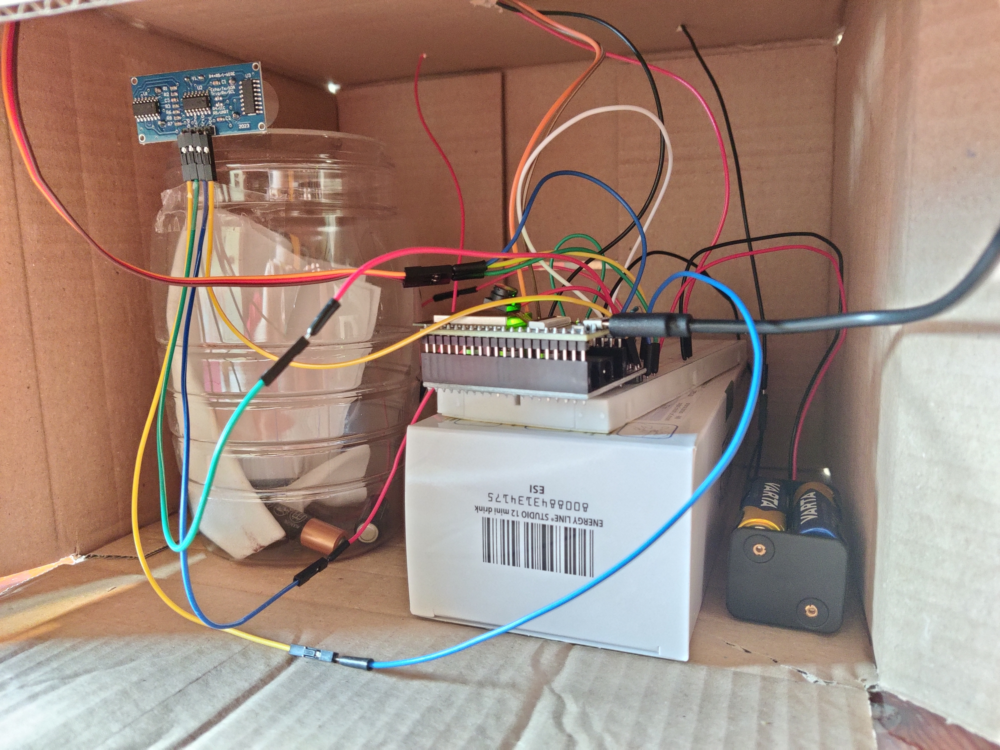
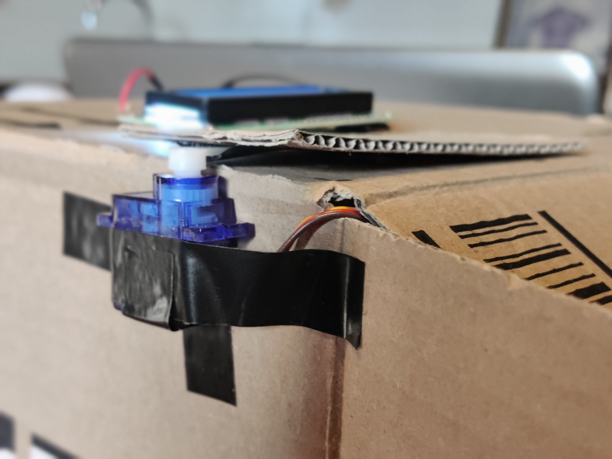

# ESP32 Battery Collection Box
Progetto d'esame per il corso di Sistemi Embedded nella facoltà di Informatica dell'Università degli Studi di Milano.

## Descrizione
Il progetto consiste in una scatola per il raccoglimento di pile usate. 
I due cavi posti nella parte frontale vengono posti ai poli di una batteria da testare e in base al voltaggio rilevato possono avvenire due cose:
- se la pila è ancora abbastanza carica viene semplicemente visualizzato sul display LCD il tipo di batteria;
- se la pila è scarica, un motore servo apre un buco nella scatola nel quale inserire la pila. Il buco si richiude automaticamente dopo 10 secondi oppure quando l'inserimento della pila viene rilevato da un sensore all'interno della scatola.

## Struttura Repository
- **BatteryBox:** cartella contenente lo sketch principale del progetto
- **Images:** contiene le immagini presenti nel README
- **Tests:** cartella che contiene i vari sketch di test che ho usato durante lo sviluppo per testare i singoli componenti

## Componenti usati

- 1x ESP32-WROVER-DEV
- 1x GPIO Extension Board
- 1x Breadboard
- 3x 10kOhm Resistenze
- 1x LCD1602 I2C Display
- 1x Servo Motor
- 1x HC-SR04
- 10x Jumper Cables

- 1x Pila 9V (alimentazione ESP32)
- 4x Pile AA (alimentazione servo)

## Librerie Usate

- **<LiquidCrystal_I2C.h>:** libreria esterna che permette di controllare display LCD che utilizzano il protocollo I2C sando solo due pin (SDA e SCL)
- **<Wire.h>:** libreria interna per gestire le comunicazioni con dispositivi I2C come sensori o display.
- **<ESP32Servo.h>:** libreria esterna per l'ESP32 e permette di controllare servo motori.
- **<UltrasonicSensor.h>:** libreria esterna che controlla comodamente il sensore di prossimità. 
- **<freertos/FreeRTOS.h> / <freertos/timers.h>:** librerie che implementano il sistema operativo FreeRTOS e la sua gestione dei timer.

## Problemi vari riscontrati durante lo sviluppo del progetto e soluzioni adottate
**PROBLEMA: Voglio misurare pile da 9V ma l'ESP32 regge voltaggi solo fino a 3.3V**

**SOLUZIONE:** Ho creato un partitore di tensione per ridurre il voltaggio in ingresso.

 

**PROBLEMA: I pin analogici di GPIO dell'ESP32 non sono molto precisi nella rilevazione del voltaggio**

**SOLUZIONE:** Includere una [funzione creata da un utente esterno](https://github.com/G6EJD/ESP32-ADC-Accuracy-Improvement-function/tree/master) che adatta i valori delle letture ai valori reali basandosi su uno storico di rilevazioni.

 

**PROBLEMA: Lo schermo LCD non risponde correttamente nonostante la disposizione dei cavi sia corretta**

**SOLUZIONE:** Cercare quali pin dell'ESP32 sono più adatti per linee SDA e usare quelli invece di pin generici.

 

**PROBLEMA: Uno dei vari componenti non funziona più dopo una nuova versione dello sketch o dopo un periodo di inattività**

**SOLUZIONE:** Uso uno sketch di test (presente nella repository) per provare il singolo elemento. Se esso funziona, il problema va cercato nel software o in possibili interferenze tra i componenti. Se anche con lo sketch non funziona il problema è fisico e controllo le connessioni, eventualmente provando a sostitutire i cavi o cambiando i pin a cui è collegato.

 

**PROBLEMA: L'IDE di Arduino non riconosce più la board in uso e quindi neanche le porte COM a cui connettersi**

**SOLUZIONE:** E' successo solo dopo l'ultimo aggiornamento dell'IDE, quindi ho scaricato una versione precedente dell'IDE dal sito ufficiale.

 

**PROBLEMA: Un timer creato con la funzione millis() risulta inefficiente e impreciso**

**SOLUZIONE:** Usare i timer di FreeRTOS.

 

**PROBLEMA: Quando il motore servo si muove fa resettare la board perchè quando sono collegati più componenti, il servo non riceve abbastanza alimentazione**

**SOLUZIONE:** Collegare una alimentazione esterna solo per il motore (i cui collegamenti vanno a GND, al pin dell'ESP32 da cui riceverà comandi e all'alimentazione con 4 pile AA).

 

**PROBLEMA: Una volta rilevata una pila devono partire sia la funzione che controlla il sensore di prossimità che il timer. Al rilevamento del sensore o al termine del timer l'altro deve essere disattivato e non continuare.**

**SOLUZIONE:** Coordino i due elementi. Quando il timer scade, esce dalla funzione in attesa; quando la funzione rileva il sensore, interrompe il timer.

## Foto
**Foto interna alla scatola**

**Foto del motore servo e dello schermo LCD**

